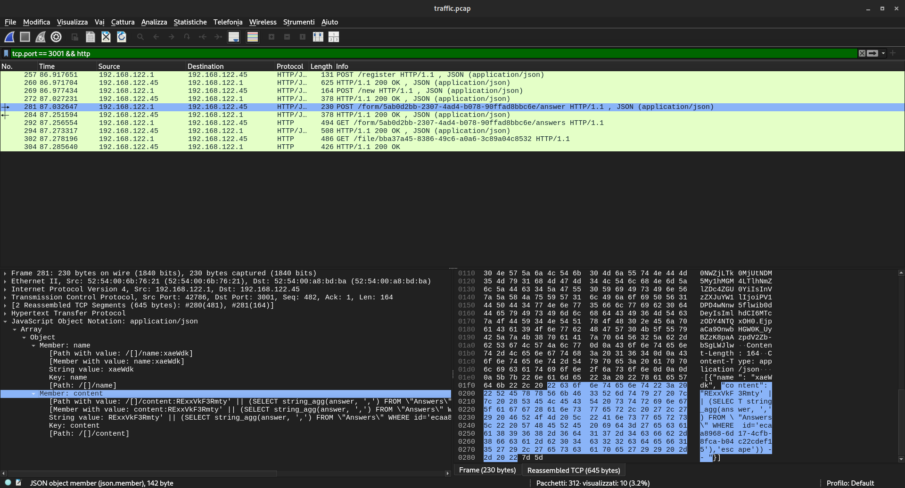
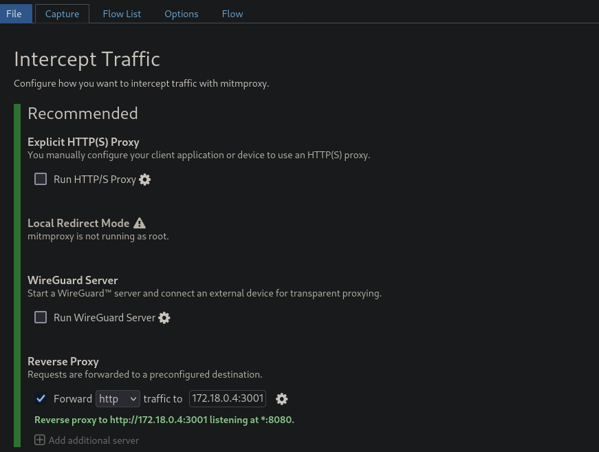

# Analisi del traffico di rete, dalle CTF alla realtà
*Roberto Pio Iannello, 5201538, Corso di laurea triennale in Ingegneria Informatica*

## CTF, cosa sono?
CTF sta per “capture the flag”, sono delle competizioni sulla cybersecurity che possono essere svolte in varie modalità, le due principali sono le Jeopardy e l’A/D.

**CTF Jeopardy**: In una CTF Jeopardy sono presenti diverse sfide inerenti alla Cybersecurity in cui bisogna ottenere una o più **flags**, che non sono altro che una sequenza di caratteri esadecimali, in base alla difficoltà per ottenerla, ogni flag ha un certo punteggio, la persona o il team che riesce ad accumulare più punti completando le sfide vince

**CTF A/D:** A/D sta per attacco-difesa, in questa modalità in genere si gioca a squadre, a ogni squadra viene assegnata una macchina virtuale con una serie di vulnerabilità (uguali per tutti). L’obiettivo di ogni squadra sarà quello di attaccare le macchine virtuali delle altre squadre per ottenere delle flags, ma al contempo dovrà anche proteggersi dall’attacco delle altre squadre

## Quali sono le analogie con la realtà?
Le tecnologie impiegate per la creazione degli ambienti simulati corrispondono a quelle utilizzate in contesti reali, inclusi sistemi operativi, linguaggi di programmazione e framework di sviluppo.
Le vulnerabilità analizzate provengono da casi reali e sono frequentemente presenti in vari software, come buffer overflow, SQL injection e cross-site scripting (XSS), utilizzate frequentemente dagli attaccanti per compromettere la sicurezza
dei sistemi.
Per affrontare queste sfide, si avvalgono di software e strumenti comunemente utilizzati nel settore della cybersecurity.


## Perché analizzare il traffico di rete?
Nel contesto di una CTF A/D entra in gioco la necessità di analizzare il traffico di rete per una serie di motivi, il primo motivo è per vedere come gli avversari ci attaccano, in questo modo, se ancora non abbiamo trovato la vulnerabilità, possiamo risolverla e sfruttarla a volte tramite dei semplici [replay attacks](https://it.wikipedia.org/wiki/Replay_attack?useskin=vector).
Un altro motivo, che sarà argomento principale di questa tesi, è la costruzione di contromisure senza modificare direttamente il codice del servizio tramite [virtual patching](https://owasp.org/www-community/Virtual_Patching_Best_Practices).

Questo tipo di soluzione presenta una serie di vantaggi che si applicano anche nel mondo reale.

Il primo vantaggio è un minor tempo di esposizione, questo perché modificare il codice per sistemare una vulnerabilità può richiedere tempo, e in questo periodo di tempo il sistema risulta essere ancora vulnerabile.

Il secondo vantaggio è un downtime nullo, dato che non è necessario riavviare il servizio o ricompilare del codice per eliminare la vulnerabilità.

Il terzo vantaggio si applica in caso di utilizzo di software legacy o sotto licenza proprietaria, perché in quel caso il codice del servizio non risulta modificabile e quindi il virtual patching risulta essere l’unica soluzione attuabile.

Purtroppo questa soluzione non è priva di svantaggi, lo svantaggio più grande è il fatto che non la si può applicare sempre ma solo nei casi in cui si può individuare e bloccare richieste che presentano la stessa struttura, un altro svantaggio può essere in termini di load balancing, in caso di un numero elevato di connessioni risulta dispendioso controllarle una a una.

## Un esempio, CCForms
Prendiamo ora come esempio un servizio presente sulle macchine virtuali dei partecipanti alla finale di [Cyberchallenge.IT](https://cyberchallenge.it/) del 2024.
Il servizio in questione è un servizio che permette di creare, condividere e compilare dei questionari, ha due “store” delle flags, ovvero le flags si trovano in due spazi differenti, noi ci concentreremo sul secondo store, che presenta due vulnerabilità, e andremo a fare degli esperimenti su una di queste, una vulnerabilità di tipo sql injection.

La vulnerabilità sta nel fatto che nei form è possibile includere dei campi che permettono agli utenti di caricare dei files, questi files sono conservati all'interno di un database utilizzando la funzione `sequelize.literal`

```javascript
for (const file of files) {
    await Files.create({
        id: file.id,
        name: file.name,
        content: sequelize.literal(`decode('${file.content}', 'base64')`)
    });
}
```
Questo viene fatto utilizzando la funzione “decode” che converte il contenuto `base64` del file in un blob prima di memorizzarlo ne database, ma questo approccio risulta vulnerabile a SQL injection.

Infatti, codificando in `base64` il seguente payload, verrà inserito all'interno del campo "content" del file il risultato della query. 

```text
' || (SELECT string_agg(answer, ',') FROM \"Answers\" WHERE id='ANSWER_ID_TO_LEAK'),'escape')) --
```

## Simulazione

Per simulare l’ambiente di gara, è necessario creare una macchina virtuale, in questo caso ho scelto una Ubuntu server (`24.04`), che dovrà avere installati i seguenti programmi:
- `docker`
- `python`
- `pip`
- `build-essential`
Oltre ad avere un server ssh per permettere l’accesso da remoto (oppure si può utilizzare una VM dotata di ambiente desktop)

Una volta configurata la macchina virtuale e installati i pacchetti necessari, si può passare al deployment del servizio, clonando la [repository ufficiale](https://github.com/CyberChallengeIT/CyberChallenge.IT-AD-2024/tree/master) contente i servizi all’interno della macchina virtuale, si può eseguire il servizio nel seguente modo:

```bash
# far partire il servizio
cd ~/sourcecode/SourceCodeFinal/services/CCForms
chmod +x ./deploy.sh # aggiungo i permessi di esecuzione
sudo ./deploy.sh
# lanciare il checker per inserire la flag all'interno dello store due
cd ~/sourcecode/SourceCodeFinal/checkers/CCForms-2
chmod +x *.sh # aggiungo i permessi di esecuzione per gli script bash
chmod +x *.py # aggiungo i permessi di esecuzione per gli script python
./setup.sh # per installare le dipendenze necessarie
./checker.py dev # eseguo il checker, che inserisce la flag nel servizio
cat ./flagid.json # per prendere l'id del form contenente la flag
```
*Si suppone che la repository sia stata clonata in `/home` nella maccina virtuale*

Eseguiamo ora una cattura del traffico utilizzando `tcpdump`
```bash
sudo tcpdump -w ./traffic.pcap -i enp1s0 not port 22 > /dev/null 2> /dev/null
```

Il traffico viene salvato all'interno del file [`traffic.pcap`](./traffic/traffic.pcap), non viene considerato il traffico per il protocollo `shh` (`not port 22`)

Una volta lanciato `tcpdump`, eseguiamo un attacco da un’altra macchina, clonando la stessa repository, si lancia l’exploit 

*Si suppone che la repository sia stata clonata su una macchina linux in `/home`*
```bash
cd ~/sourcecode/SourceCodeFinal/exploits
python3 CCForms-2-sqli.py 192.168.122.45 '{"answer_id":"9bf0f500-bb88-4795-866f-49699051ad0f","form_id":"05683936-930c-40bb-9a04-7152bf45c8f9"}'
```


Dove il primo argomento è l’ip della macchina virtuale sulla quale gira il servizio e il secondo argomento è invece il contenuto di “flagid” all’intero del file `flagid.json`, ottenuto in precedenza eseguendo il checker

Una volta eseguito l’exploit ci verrà mostrata a schermo la flag.
A questo punto interrompiamo la cattura dei pacchetti dalla macchina virtuale e analizziamola con [Wireshark](https://www.wireshark.org)

Filtriamo i pacchetti http diretti alla porta dell’API, ovvero la porta `3001`


Da Wireshark troviamo il pacchetto contenente il payload malevolo, il nostro obiettivo ora sarà quello di bloccare tutte le richieste contenenti payload simili, in questo caso per semplificare le cose bloccheremo tutti i pacchetti che contengono la stringa `select`.

## Virtual Patching con [mitmproxy](https://mitmproxy.org/)

Mitmproxy è uno strumento molto utile utilizzato spesso per testare la sicurezza di servizi web, nel nostro caso lo utilizzeremo come reverse proxy, ovvero, le richieste prima di arrivare al servizio, passeranno prima per mitmproxy, dove tramite la sua interfaccia web è possibile visualizzare le attività ed eventualmente bloccare alcune richieste.

Mitmproxy è inoltre espandibile tramite script Python, noi utilizzeremo uno script molto semplice che aggiungerà la stringa “sqli” all’header del pacchetto, per poter poi filtrare in modo semplice i pacchetti che contengono una sql injection, lo script è il seguente

```python
import re

def response(flow):
    if re.findall(r'SELECT', flow.request.text):
        flow.response.headers["newheader"] = "sqli" 
```

A questo punto possiamo lanciare mitmproxy.
```bash
# installazione 
mkdir mitmproxy
curl -w "https://downloads.mitmproxy.org/11.1.0/mitmproxy-11.1.0-linux-x86_64.tar.gz" -o mitmproxy.tar.gz
tar -xzf mitmproxy.tar.gz
# inseriamo lo script python nella stessa cartella
./mitmweb --no-ssl-insecure --web-host 192.168.122.45 -s filter.py 
```

Una volta fatto partire, mitmproxy eseguirà due servizi, il primo è il reverse proxy, in esecuzione sulla porta `8080` e il secondo sarà la web ui alla quale collegarsi per poter gestire il proxy sulla porta `8081`.

Configuriamo ora mitmproxy in modalità reverse proxy per inoltrare le richieste al container


Dove l’indirizzo è quello del container docker sul quale è in esecuzione il servizio.

Inoltre, noi non vogliamo che gli attaccanti si rendano conto di questo cambiamento, dobbiamo mantenere comunque la porta `3001`, questo perché nei contesti di gara non è concesso cambiare la porta, ma anche in un contesto reale ciò comporterebbe un interruzione del servizio. Ovvero noi vorremmo il comportamento seguente.


Utilizzeremo quindi `iptables` per reindirizzare il traffico dalla porta 3001 alla porta 8080 sulla quale è in ascolto mitmproxy.

```bash
sudo sysctl -w net.ipv4.ip_forward=1 # abilitiamo l'ip forwarding
# inoltriamo il traffcio in ingresso dalla porta 3001 alla porta 8080
sudo iptables --table nat --append PREROUTING --protocol tcp --dport 3001 --jump REDIRECT --to 8080 
# eliminiamo la regola docker che reindirizzava il traffico dalla porta 3001 al container
sudo iptables -t nat -D DOCKER 4 
```


Ora è possibile bloccare tutte le richieste malevole tramite la funzionalità intercept, applicando un filtro sull´header del pacchetto, modificato grazie allo script python visto in precedenza.


In questo modo è possibile bloccare e visualizzare tutte le richieste contenti la stringa `SELECT`

## Conclusioni
Abbiamo dimostrato quindi come, in pochi passaggi, è stato possibile bloccare degli attacchi di tipo sql injection, inoltre abbiamo raggiunto il nostro obiettivo con i vantaggi discussi in [precedenza](#perché-analizzare-il-traffico-di-rete), ovvero con un downtime nullo e senza modificare il codice del servizio.

Mitmproxy è stato eseguito senza privilegi da amministratore, l’unica operazione che ha richiesto questo tipo di permesso è stata la modifica delle politiche di indirizzamento tramite iptables, il che è da considerarsi come un ulteriore vantaggio perché potrebbero esserci casi in cui non si hanno i permessi necessari per interagire direttamente col servizio.