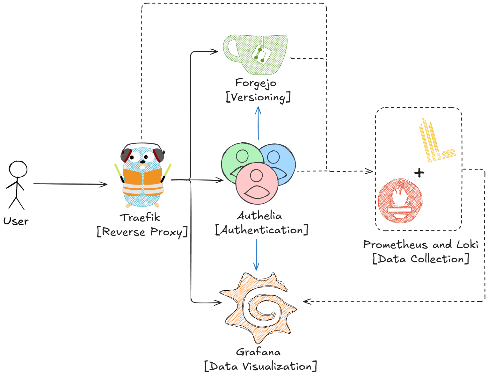
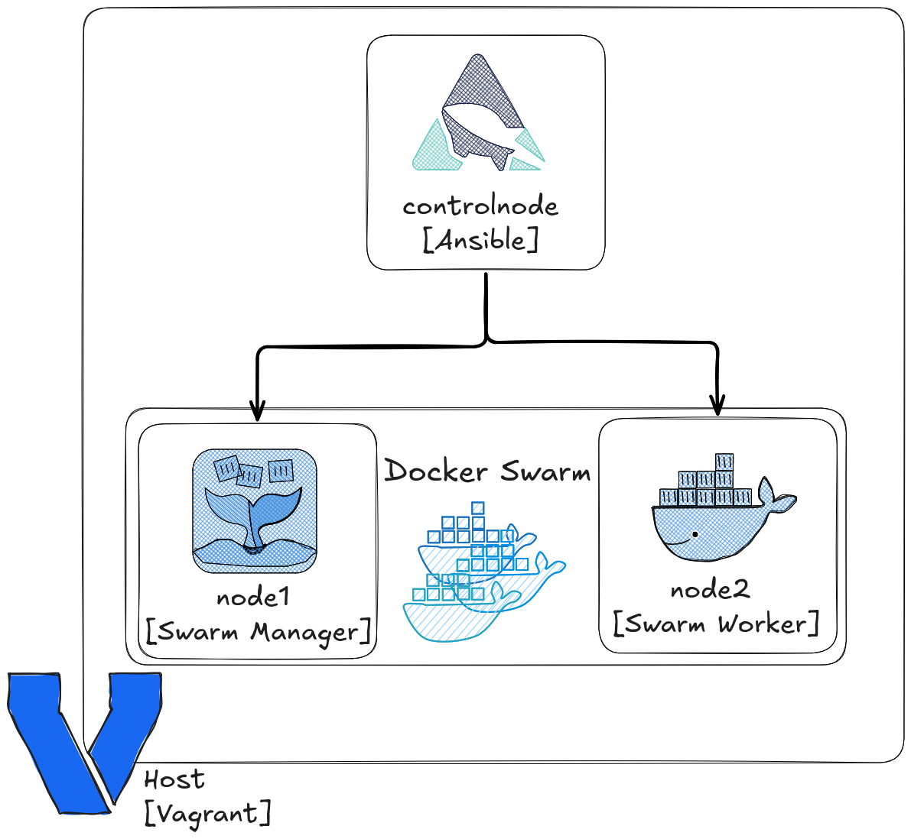
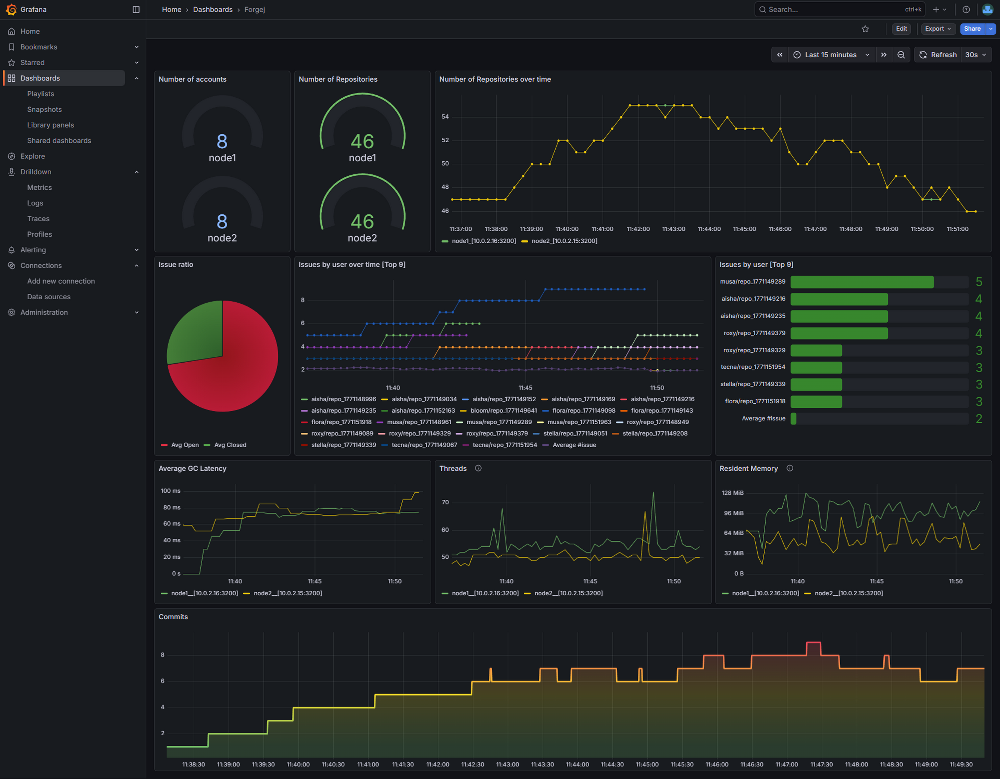

In questo articolo, riporterò in italiano il contenuto delle slides utilizzate per presentare il progetto

## Chi ha realizzato il progetto

|                                                                                                                                                                                                                            |                                                                                                                                                                                                                 |
|----------------------------------------------------------------------------------------------------------------------------------------------------------------------------------------------------------------------------|-----------------------------------------------------------------------------------------------------------------------------------------------------------------------------------------------------------------|
|  Lorenzo     Massone        |  [github.com/cunoucu](https://github.com/cunoucu)       |
|   Roberto Pio Iannello |  [github.com/roby_ianny](https://github.com/roby_ianny) |

## Panoramica del progetto

Il progetto consiste nella realizzazione di un'infrastruttura cloud utilizzando tecnologie di virtualizzazione. 

In particolare, i servizi esposti sono: 
- **Forgejo**: servizio di hosting per repository git 
- **Authelia**: Servizio di autenticazione e autorizzazione
- ** Traefik**: Reverse proxy e load balancer
- **Prometheus e Loki**: Servizi di monitoraggio 
- **Grafana**: Per visualizzare i dati monitorati da Prometheus e Loki

## Cosa abbiamo imparato

Abbiamo imparato che l'Infrastructure as Code è come una matrioska, nel nostro caso, lo strato più esterno, ovvero le macchine virtuali, gestite da Vagrant.
Una di queste virtual machine, chiamata `controlnode`, svolgeva il ruolo di nodo di controllo per Ansible, per automatizzare la configurazione di se stesso e delle altre due macchine virtuali collegate: `node1` e `node2`.
`node1` a sua volta svolge il ruolo di manager di un Docker Swarm (oltre che di worker), mentre `node2` è un worker del cluster.

## Difficoltà incontrate

### Jinja2: Explicit is better than implicit

Abbiamo lavorato partendo dal presupposto che Jinja2 avrebbe renderizzato qualsiasi file che utilizzasse la sua sintassi, ma abbiamo scoperto che non è così. 
Dopo ore di debug e un'analisi approfondita della documentazione, possiamo confermare che non è così, perchè per applicare i template bisogna indicarlo all'interno del task di Ansible.

### Traefik lab-hell

C'è stata una fase in cui tutti i servizi erano up and running, ma non riuscivamo ad accedervi. Grazie al consiglio di una collega, abbiamo scoperto di aver dimenticato di inserire i labels di traefik per Authelia e Forgejo, e quindi Traefik non sapeva come instradare le richieste verso questi servizi.

## Log Insight: Forgejo

Abbiamo creato diverse Dashboard per i vari servizi e per riportare lo stato del sistema, qui riportiamo solo quella di forgejo, dato che nella nostra interpretazione è il servizio principale. 

## Possibili miglioramenti

- Grazie al design scalabile, si potrebbero aggiungere ulteriori nodi al cluster Docker Swarm per aumentare la capacità di elaborazione e migliorare la tolleranza ai guasti.
- Sia Forgejo che Grafana hanno un proprio sistema di autenticazione integrato, che potrebbe essere rimosso per centralizzare l'accesso con Authelia.