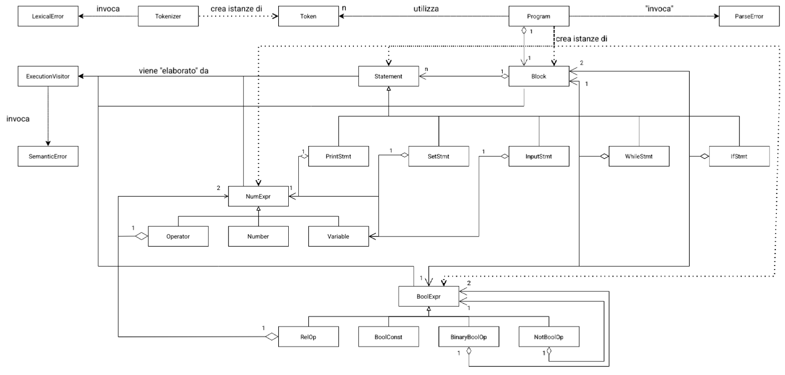

L'obiettivo del progetto è quello di realizzare un interprete per un linguaggio LISP-LIKE in C++.
Ciò avviene in 3 fasi:

## Analisi Lessicale
In questa fase si prende il file di input e si genera una sequenza di Token, ovvero una sequenza di coppie id-word che servono da ponte tra il "programma in ingresso" e il parser, che si occuperà dell'analisi lessicale.

La libreria Token.h definisce i token per i vari elementi del "linguaggio", mentre Token.cpp contiene l'overloading dell'operatore di inserimento.

Tokenizer invece si occupa di convertire le parore in ingresso in una sequenza di Token, occupandosi della conversione di numeri e di variabili.

## Analisi Sintattica
L'analisi sintattica si occupa di prendere la sequenza di Token, e generare l'albero sintattico. L'albero sintattico verrà poi passato al ExecutionVisitor per l'analisi semantica.
Program è la classe che si occupa di effettuare il parsing tramite il metodo RecursiveParse. Esso contiene un istanza della classe "Block", che indica il blocco principale, similarmente al "main" in C++. Block può essere composto da ulteriori sotto-blocchi, ma il principale è uno ed uno soltanto.
Block è appunto la classe che indica il blocco, che, come definito dalla CFG, contiene una lista di statement e/o altri blocchi, a loro volta strutturati in questo modo.
Per il parsing si utilizza il pattern del FactoryMethod, quindi il parser legge una sequenza di token, e, in base a quale statement/espressione coincidono, vengono costruiti uno o più elementi della classe "Statement". 
Alla fine il Block associato alla classe ParseExpression conterrà un vector di statement, che verranno poi letti ed eseguiti invece dal ExecutionVisitor.

## Analisi semantica
Esegue le istruzioni risalendo l'albero sintattico costruito nelle fasi precedenti

