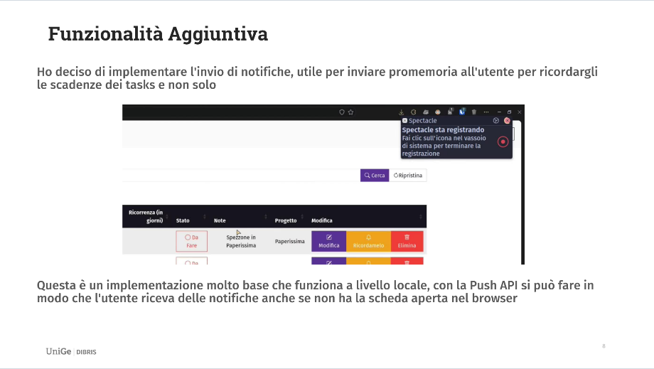

## Struttura DB

## Features
Obbligatorie:

- [X] Presentazione di startSAW
- [X] Registrazione di un utente
- [X] Login al sistema
- [X] Visualizzazione del profilo utente
- [X] Modifica del profilo utente
- [X] Motore di ricerca interno
- [X] Logout

A scelta:

- [X] Notifiche

## Funzionalità




## Testing
- Uso dell'immagine docker [tomsik68/xampp](https://hub.docker.com/r/tomsik68/xampp/)
```bash
docker compose up -d --build
```

## Risorse utilizzate
- Stilying e Animazioni
    - [Bootstrap](https://getbootstrap.com/)
    - [Custom Bootstrap](https://bootswatch.com/)
- [Icone](https://icons.getbootstrap.com/)
- Javascript
    - [jQuery](https://jquery.com/)
    - [DataTables](https://datatables.net/)
